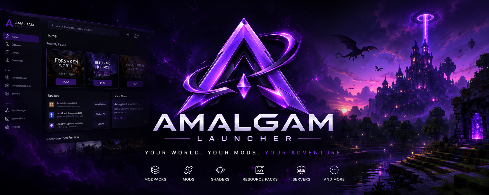

# Amalgam

A hybrid **utility client + unified launcher** for Minecraft: Java Edition, covering **1.12 → latest**, plus Quilt — all from ONE launcher (no separate launchers per edition/loader). Bedrock packaging is present for a future release, but Bedrock runtime actions are intentionally marked **Coming Soon** in 1.0.0.



It combines:

- a **C++ launcher** (`amalgam_launcher.exe`, ImGui) that resolves versions/loaders/Java, verifies and downloads everything (Mojang assets, libraries, native jars, mods), and starts the game with the utility client injected;
- a **C++ utility client DLL** (`amalgam.dll`) injected via `-agentpath`, with a JNI/JVMTI bridge, an ImGui menu, and a tick-start action pipeline;
- **Java bridge mods** (Fabric, Quilt, NeoForge, and Forge 1.12.2/1.18.2/1.19.2/1.20.1) that talk to the native side and apply actions using **only existing vanilla packets**;
- a **mod browser** (Modrinth + CurseForge) and an **AI modpack assistant** (chat, vision, image generation) with multi-provider failover.
- per-instance **performance profiles** (Auto, Low-end, Balanced, Shaders, Heavy modpack) with adaptive heap/JVM tuning, reversible game-option presets, and loader-aware optimization-mod recommendations.
- local **content upload/import** for Java `.jar` mods, resource/shader/datapack ZIPs, and validated release assets from CurseForge or any other platform. Bedrock `.mcpack`/`.mcaddon` runtime import is Coming Soon.

> Design rule (fixed): no custom packets. Every action is expressed through packets vanilla already uses, and all actions are applied at the **start of the game tick**. See `docs/packet-whitelist.md`.

## Coverage

| Loader | Versions | Adapter |
|---|---|---|
| Fabric | 1.18.2 / 1.19.2 / 1.20.1 / 1.21.1 / 1.21.4 / 1.21.5 / 1.21.6 / 1.21.8 / 1.21.11 | `java/` (Yarn) |
| Quilt | ≥1.14.4 via quilt-loader (beta) | reuses the Fabric bridge jar + plain `fabric-api.jar` |
| NeoForge | 1.21.1 / 1.21.4 / 1.21.5 / 1.21.6 / 1.21.8 / 1.21.11 | `java-neoforge/` (Mojang) |
| Forge | 1.12.2 / 1.18.2 / 1.19.2 / 1.20.1 bridge | `java-forge-1.12.2/`, `java-forge-legacy/`, `java-forge/` |
| Bedrock | Windows package prepared | Coming Soon — static package validation only |

## Layout

```
cpp/                       C++ codebase
  src/                     utility client DLL (amalgam.dll)
    core/                  protocol (V2 wire format), pipeline, tracker
    bridge/                JNI/JVMTI bridge
    modules/               freecam, fly, speed, nofall, autotool, killaura
    render/                ImGui layer + input
  launcher/src/            launcher (amalgam_launcher.exe)
    model/launch/java/     version/loader resolution, launch, java provisioning
    net.cpp                downloads: sha1/size verification, URL policy, retries, caps
    extract.cpp            hardened archive extraction (entry scan, staging)
    instances.*            instance model, scan/save/remove
    mods/ai/               Modrinth/CurseForge clients, AI (chat/vision/image)
    ui.cpp                 ImGui launcher window
  tests/                   CTest suites (protocol, telemetry, diagnostics, json, model, net, java bridge)
  vendor/                  imgui, minhook
java/                      Fabric bridge (multi-project Gradle, Yarn)
java-neoforge/             NeoForge bridge (multi-project Gradle, Mojang)
java-forge/                Forge 1.20.1 bridge (ForgeGradle 6, Mojang)
java-forge-legacy/         Forge 1.18.2/1.19.2 bridges (ForgeGradle 5, Mojang)
java-forge-1.12.2/         Forge 1.12.2 bridge (ForgeGradle 2.3, MCP, Java 8)
docs/                      architecture, packet whitelist, support matrix, security
```

## Build

**Launcher + DLL + tests** (Windows, MSVC + ninja):

```
call "C:\Program Files\Microsoft Visual Studio\18\Community\Common7\Tools\VsDevCmd.bat" -arch=x64 -host_arch=x64
cmake -S cpp -B cpp\build -G Ninja -DBUILD_TESTING=ON -DAMALGAM_STRICT_HARDENING=ON
cmake --build cpp\build
ctest --test-dir cpp\build --output-on-failure
```

Outputs: `cpp/build/amalgam_launcher.exe`, `cpp/build/amalgam.dll`. All 45
CTest checks must pass. Native release builds enable strict warnings, exception
handling, SDL checks, ASLR, DEP, and Control Flow Guard by default; set
`-DAMALGAM_STRICT_HARDENING=OFF` only for a diagnosed local toolchain issue.

**Java bridges** (Gradle 9.5.0 + JDK 21, Loom):

```
set JAVA_HOME=C:\Users\David\AppData\Local\Temp\opencode\jdk-21.0.12+8
set GRADLE_USER_HOME=C:\Users\David\AppData\Local\Temp\opencode\gradle-home
C:\Users\David\AppData\Local\Temp\opencode\gradle-9.5.0\bin\gradle.bat -p java build        (Fabric)
C:\Users\David\AppData\Local\Temp\opencode\gradle-9.5.0\bin\gradle.bat -p java-neoforge build  (NeoForge)
C:\Users\David\AppData\Local\Temp\opencode\gradle-8.8\bin\gradle.bat -p java-forge build  (Forge 1.20.1, JDK 17)
copy java\*\build\libs\amalgam-fabric-*.jar cpp\build\bridges\
copy java-neoforge\neoforge-*\build\libs\amalgam-neoforge-*.jar cpp\build\bridges\
copy java-forge\build\libs\amalgam-forge-*.jar cpp\build\bridges\
```

## CLI

```
--versions [loader]                    list compatible versions
--check-java                           list detected Java runtimes
--java-install <8|11|17|21|25>         download a managed Java runtime
--check-official-launcher               locate the official Minecraft Launcher
--check-prereqs                        check tar, DLL, SQLite, and MSVC runtime prerequisites
--doctor [--online]                    player-readiness report; --online verifies Modrinth/CurseForge access
--ui-snapshot <out.png> [width] [height] [home|discover|library|profile|project|downloads|settings|account|servers|bedrock|essentials|admin|java|backups|logs|config|theme|performance|social|mods]
                                        capture a deterministic, non-persistent UI visual-QA frame
--login                                Microsoft sign-in guidance; direct device-code login activates after publisher approval
--logout                               remove the local authenticated account
--inspect <mc_id> [loader]             print resolved loader/merge/lib/java info
--launch <mc_id> [loader] [--dry-run] [--wait] [--print-command]  launch; --wait keeps console output and returns game exit code
--mods-search <query> [loader] [game_version] [facet]
--mods-install <slug> [source] [loader] [game_version] [mods_dir]
--pack-install <slug> [source] [loader] [game_version] [instances_dir]
--ai-chat <message> [model]
--ai-image <prompt> [out.png]
--ai-vision <image> [model]
--bedrock-info / --bedrock-launch / --bedrock-install <addon.mcpack>
```

## Configuration

`launcher.json` next to the exe holds instance paths, loader, an optional **Modrinth token**, **CurseForge API key**, and AI settings. `--mods-search` returns results from both configured providers; `--mods-install` defaults to Modrinth for backwards compatibility, or accepts `curseforge` explicitly after the slug. Multi-provider AI failover uses the `ai_providers` array (index 0 = main, rest = automatic backups). Keys are stored locally with Windows DPAPI protection, never committed (`.gitignore`), and legacy plaintext settings migrate on their next save. Microsoft account login is started with `--login`; account tokens are DPAPI-protected under `%LOCALAPPDATA%\Amalgam`, not stored in `launcher.json`. See `docs/security.md`.

Java Edition sign-in is password-free: the launcher never collects a Microsoft password. Direct Amalgam device-code sign-in is held until the publisher's Minecraft application approval is active; until then, `--login` provides the official Minecraft Launcher fallback. Bedrock is currently a Coming Soon surface: the static package is validated and shipped as release input, while detection, launch, and add-on import remain disabled until the supported runtime release. Amalgam does not bypass Microsoft/Store licensing.

## Testing

- `cpp/tests/` — CTest: protocol (V1/V2 golden bytes), tracker (validation/stale/sort), game-mode telemetry (profiles/normalization/override/markers), diagnostics outbox (opt-in SQLite persistence/export/delete), native tick modules, mod compatibility selection, AI endpoint policy, JSON, model (rank/rules/args), net (SHA-1/SHA-256 integrity and HTTPS URL policy), launcher `--check-java` and prerequisite smoke tests, and separate Fabric/NeoForge/Forge Java bridge protocol/codec tests.
- Press `F7` in-game for a local match marker. HUD export produces match summaries, markers, session statistics, and the existing telemetry report. Diagnostics persistence is disabled until explicitly enabled in the HUD editor.
- Press `F8` or use the HUD editor to record a redacted binary telemetry replay (`*.replay.amrl`); it stores summaries/markers, not world state or packets.
- The native DLL exposes the in-game Amalgam control panel with `Insert` across supported loaders; it exposes module toggles, profile presets, parameter controls, and server-safe mode without pausing the client. Forge no longer ships a duplicate Java-only panel.

See `V9-OPERATIONAL-READINESS-REPORT.md` for the current completion and release-readiness assessment.
See `docs/release-gates.md` for the remaining account, platform, signing, and clean-machine gates before public release.
- The V2 wire format is enforced on both sides by byte-level tests (`cpp/tests/protocol_test.cpp`, `java/common/.../ProtocolTest.java`).

## License

Private / personal use.
